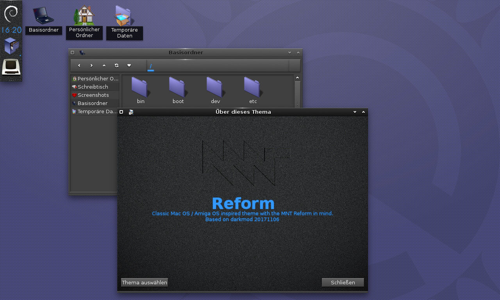

# Reform
A classic Mac OS / Amiga OS inspired theme with the MNT Reform in mind.
Based on darkmod (20171106) for Enlightenment e24.

The icon theme works best with [Mojave-CT](https://github.com/zayronxio/Mojave-CT) installed.

## Changes

### 2021-01-07
- Updates in build script (needs cleanup ...)
- Updated default wallpaper 

### 2020-10-05
- Optimized efm icons, added mime icons to main icon set
- Integrated RePlatinum/NeXTSpirit Icons in fdo icon theme
- Removed SVG icons from fdo
- Removed icon coloring from build-Reform.sh
- Added background texture on shelf
- Debian Logo on start-widget
- New default wallpaper

### 2020-09-24
- Icons: Folder/Devices ported with permission from RePlatinum / NeXTSpirit by Gaël Elegoët. Files (only e24 for now) by me.

### 2020-09-20
- Base theme: Window close moved to the left, close button styled as box, digital clock background fixed, about window