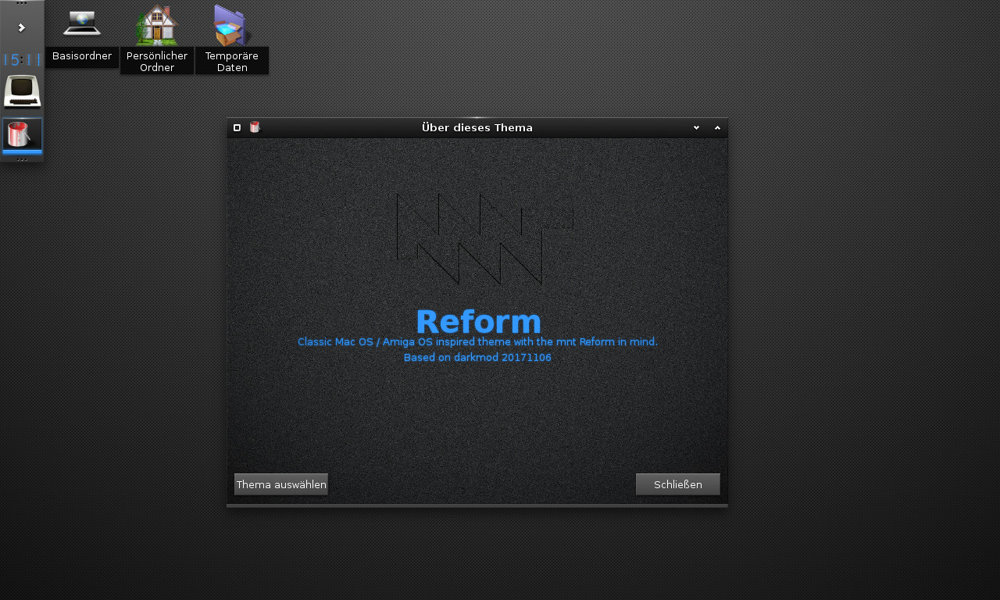

# Reform
A classic Mac OS / Amiga OS inspired theme with the mnt Reform in mind.
Based on darkmod (20171106) for Enlightenment e24.

The icon theme works best with [Mojave-CT](https://github.com/zayronxio/Mojave-CT) installed.

## Changes

### 2020-09-24
- Icons: 
 - Folder/Devices ported with permission from RePlatinum / NeXTSpirit by Gaël Elegoët
 - Files (only e24 for now) by me

### 2020-09-20
- Base theme:
 - Window close moved to the left
 - Close button styled as box
 - Digital clock background fixed
 - About window